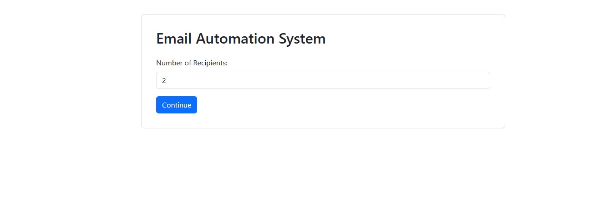
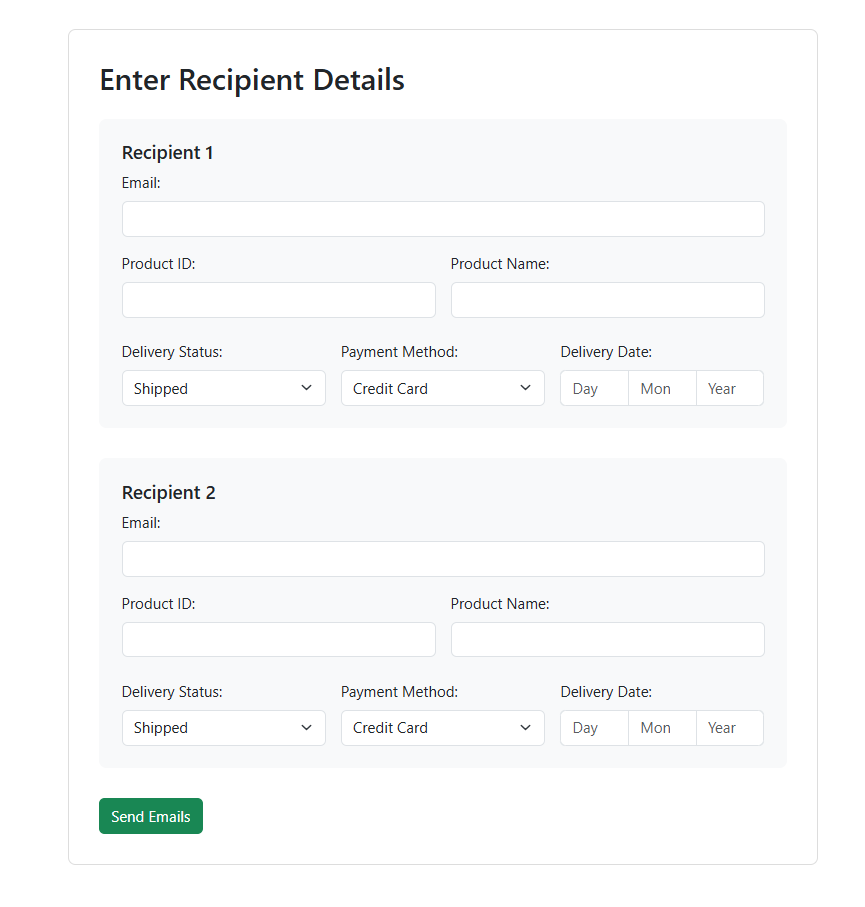

# 🚀 Email Automation System with OTP Verification




## Overview

The **Email Automation System with OTP Verification** is a Flask-based application designed to automate the process of sending order update emails with a unique One-Time Password (OTP) for verification. The system collects recipient details along with product and delivery information via dynamic forms, sends personalized emails through a secure SMTP connection, and then verifies the OTPs entered by users.

## Key Features

- **Dynamic Recipient Form**  
  Generate forms dynamically based on the number of recipients.

- **Personalized Email Automation**  
  Sends order updates with product details, delivery status, and payment method using SMTP.

- **OTP Generation & Verification**  
  Each email contains a unique 5-digit OTP, which is verified through a dedicated interface.  
  - OTP verification results are displayed in a color-coded table.

- **Secure SMTP Connection**  
  Utilizes TLS for encrypted email communication.

- **User Feedback**  
  Integrated flash messaging for real-time error and success notifications.

## Technologies Used

- **Backend:** Python, Flask  
- **Frontend:** HTML, Bootstrap, Jinja2 Templates  
- **Email Handling:** Python's `smtplib` and `email` modules  
- **Other:** Session management for multi-step workflows

## Project Workflow

1. **Initialization:**  
   - The user starts at the home page and inputs the number of recipients.
   - The recipient count is stored in the session for further processing.

2. **Data Collection:**  
   - A dynamic form collects details for each recipient, including email, product ID, product name, delivery status, payment method, and delivery date.
   - An OTP is generated for each recipient during this process.

3. **Email Delivery:**  
   - A secure SMTP connection is established.
   - Personalized emails with delivery details and OTPs are sent to each recipient.
   - Notifications (including OTPs) are stored in the session.

4. **OTP Verification:**  
   - Users are prompted to enter the OTPs they received.
   - The application verifies the entered OTPs against the generated ones and displays the results in a color-coded table.

5. **Security Considerations:**  
   - Session management for a secure multi-step workflow.
   - TLS is used for secure email delivery.
   - Error handling and proper cleanup of SMTP connections ensure stability.

## Setup & Installation

### 1. Clone the Repository

```
git clone https://github.com/yourusername/email-automation-system.git
cd email-automation-system
```

### 2. Create a Virtual Environment
```
python -m venv venv
```

### 3. Activate the Virtual Environment
```
venv\Scripts\activate
```

### 4.  Install Required Packages
```
pip install flask
(Additional packages such as pandas can be installed if required by your project.)
```
### 5.  Configure SMTP Credentials
- Open app.py and email_sender.py.
- Update the SMTP settings, sender email, and sender password.
Note: For production, store these credentials in environment variables.

### 6. Run the Application
```
python app.py
```
The Flask development server will start (by default on http://127.0.0.1:5003). Open this URL in your browser to access the application.

### Future Enhancements
- Environment Variables:
     Store sensitive credentials in environment variables.
- CSRF Protection:
     Implement CSRF tokens for form submissions.
- User Authentication:
     Add user login functionality for additional security.
- Rate Limiting:
    Prevent abuse by limiting repeated requests.
- HTTPS:
    Deploy the app using HTTPS for secure communications.
